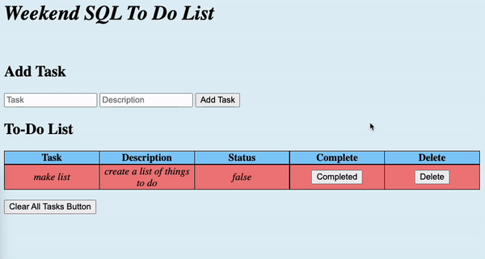

# T0-Do List

Create a list of tasks to complete. 

 

# Prerequisites

- [Node.js](https://nodejs.org/en/)
- [HomeBrew](https://brew.sh/)
- [Postico](https://eggerapps.at/postico/)

    Recomended but NOT required:
- [VS Code](https://code.visualstudio.com/) 
- [Postman](https://www.postman.com/downloads/)

# Description

Page shows a list of tasks to be completed. You can add and delete tasks. 

To add a task to the list just enter the tasks name and a short description into the two input fields with corresponding text in them. Then press "Add Task"

The task will show up in the list. They default to "un-completed" and show as light red.

If you want to mark a task as completed just click the "Complete" button in it's same row. Once it's clicked it will change to "Completed" status and will turn the row light green. 

If you want to delete a task just click the "Delete" button in it's row.

<!-- 

# Project Name

[Project Instructions](./INSTRUCTIONS.md), this line may be removed once you have updated the README.md

## Description

Your project description goes here. What problem did you solve? How did you solve it?

Additional README details can be found [here](https://github.com/PrimeAcademy/readme-template/blob/master/README.md). -->
